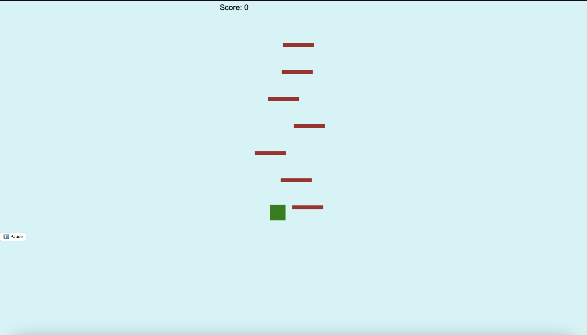
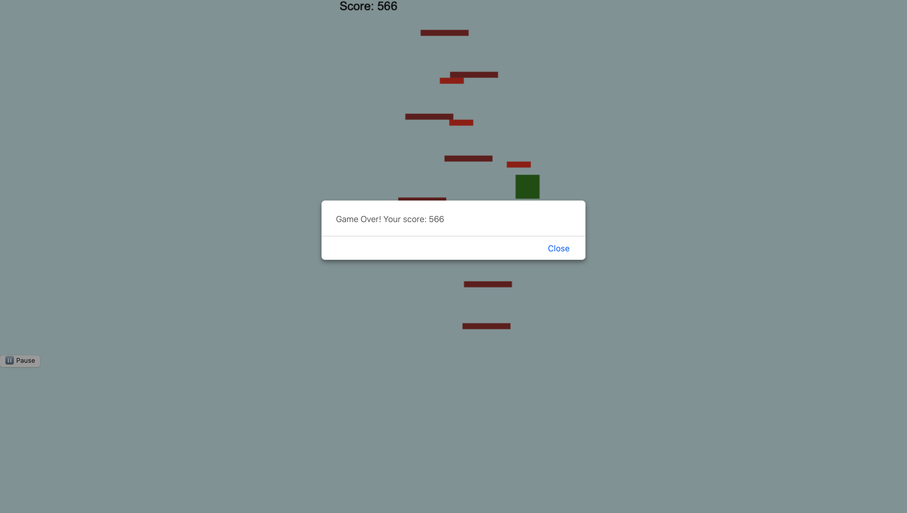

# 🕹️ Doodle Jump - Web Game

A fun and addictive browser-based version of the popular Doodle Jump game. Built using HTML5, CSS3, and JavaScript, this project is designed to work smoothly across desktops and mobile devices with no downloads required.

---

## 📌 Project Description

This project recreates the core mechanics of Doodle Jump:
- The player controls a character that jumps upward automatically.
- New platforms, power-ups, and obstacles generate dynamically.
- The goal is to reach the highest score possible without falling.

---

## 🧰 Technologies Used

- **HTML5** – Canvas element for game rendering.
- **CSS3** – Responsive UI design.
- **JavaScript (Vanilla)** – Core game logic and animations.
- **Incompetech** – Background music.
- **GitHub Pages** – Free deployment of the game.

---

## 🎮 Features

- Responsive controls (arrow keys on desktop, swipe on mobile).
- Infinite vertical scrolling with dynamic platforms.
- Power-ups (boost jumps) and red obstacles (game over).
- Score counter and game over alert.
- Background music and sound effects.
- Pause and resume options.

---

## 📸 Screenshots

> *(Save your screenshots in a folder named `screenshots/` and update these links)*

|  |  | 

---

## 🎥 Video Demonstration

https://drive.google.com/file/d/1nDcJxz7dYUUOHS_DAMaTqqxBH1PYlskH/view?usp=share_link

---

## 🚀 Live Game Link

Play now:  
[**https://your-username.github.io/doodle-jump-game/**](https://jerrywilliams0201.github.io/Doodle-jump-game0/)

---

